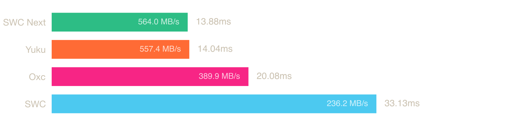
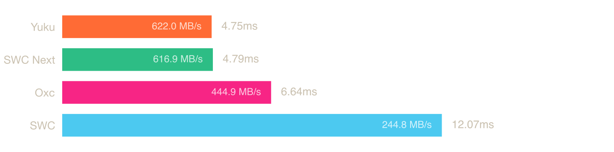
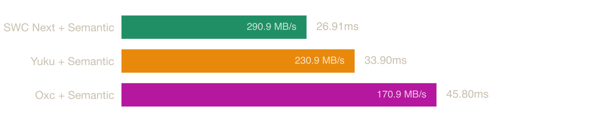
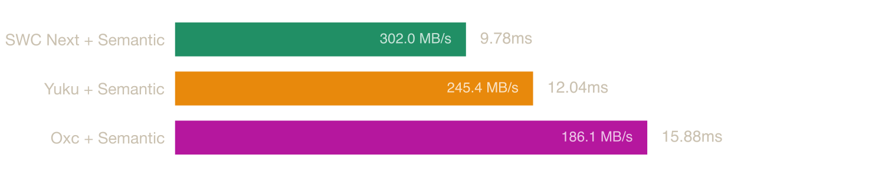
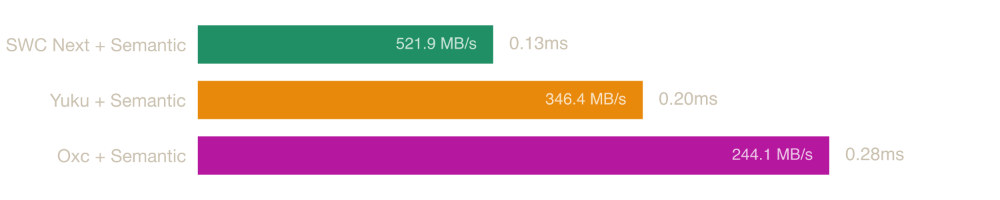

# Native ECMAScript Parser Benchmark

Benchmarks for ECMAScript parsers compiled to native binaries (Zig, Rust), measuring raw parsing speed without any JavaScript runtime overhead.

## System

| Property | Value |
|----------|-------|
| OS | macOS (Darwin kernel) 25.6.0 (arm64) |
| CPU | Apple M5 Max |
| Cores | 18 |
| Memory | 64 GB |
| Run started (UTC) | 2026-10-09T09:37:45.989Z |
| Rust | rustc 1.98.0 (88d9e12ae 2026-08-18) |
| Zig | 0.16.0 |
| Bun | 1.4.0 |

Oxc: `0.102.0`; SWC: `33.0.1`; SWC Next: `0.2.4` from [crates.io](https://crates.io/crates/swc_next_ecma_parser/0.2.4).

Yuku source: [pinned revision](https://github.com/yuku-toolchain/yuku/commit/4d29aa321e40cc1d04f561c58f25f56883489850). Fixture source: [`e25ab06730f743838b2c693d2126ea0162a661c6`](https://github.com/yuku-toolchain/parser-benchmark-files/commit/e25ab06730f743838b2c693d2126ea0162a661c6). Toolchain versions, input sizes and SHA-256 hashes, and binary hashes are saved in [result/metadata.json](result/metadata.json).

## Parsers

### [Yuku](https://github.com/yuku-toolchain/yuku)

**Language:** Zig

A high-performance & spec-compliant JavaScript/TypeScript compiler toolchain written in Zig.

### [Oxc](https://github.com/oxc-project/oxc)

**Language:** Rust

A high-performance JavaScript and TypeScript parser written in Rust.

### [SWC](https://github.com/swc-project/swc)

**Language:** Rust

An extensible Rust-based platform for compiling and bundling JavaScript and TypeScript.

### [SWC Next](https://github.com/swc-project/swc-next)

**Language:** Rust

The next-generation SWC parser, built from its published crates.io release.

## Benchmarks

### [typescript.js](https://raw.githubusercontent.com/yuku-toolchain/parser-benchmark-files/e25ab06730f743838b2c693d2126ea0162a661c6/typescript.js)

**File size:** 7.83 MB



| Parser | Median | Min | p99 | Relative |
|--------|--------|-----|-----|----------|
| SWC Next | 13.88 ms | 13.28 ms | 19.94 ms | 1.00× |
| Yuku | 14.04 ms | 13.48 ms | 16.07 ms | 1.01× |
| Oxc | 20.08 ms | 19.56 ms | 21.16 ms | 1.45× |
| SWC | 33.13 ms | 32.25 ms | 42.55 ms | 2.39× |

### [checker.ts](https://raw.githubusercontent.com/yuku-toolchain/parser-benchmark-files/e25ab06730f743838b2c693d2126ea0162a661c6/checker.ts)

**File size:** 2.95 MB



| Parser | Median | Min | p99 | Relative |
|--------|--------|-----|-----|----------|
| Yuku | 4.75 ms | 4.54 ms | 4.99 ms | 1.00× |
| SWC Next | 4.79 ms | 4.52 ms | 6.21 ms | 1.01× |
| Oxc | 6.64 ms | 6.37 ms | 7.93 ms | 1.40× |
| SWC | 12.07 ms | 10.71 ms | 19.00 ms | 2.54× |

### [lib.dom.d.ts](https://raw.githubusercontent.com/yuku-toolchain/parser-benchmark-files/e25ab06730f743838b2c693d2126ea0162a661c6/lib.dom.d.ts)

**File size:** 2.24 MB


| Parser | Median | Min | p99 | Relative |
|--------|--------|-----|-----|----------|
| SWC Next | 1.46 ms | 1.40 ms | 2.04 ms | 1.00× |
| Yuku | 1.72 ms | 1.61 ms | 1.78 ms | 1.17× |
| Oxc | 1.84 ms | 1.79 ms | 2.04 ms | 1.26× |
| SWC | 3.95 ms | 3.79 ms | 6.34 ms | 2.71× |

### [react.js](https://raw.githubusercontent.com/yuku-toolchain/parser-benchmark-files/e25ab06730f743838b2c693d2126ea0162a661c6/react.js)

**File size:** 0.07 MB


| Parser | Median | Min | p99 | Relative |
|--------|--------|-----|-----|----------|
| SWC Next | 0.07 ms | 0.06 ms | 0.14 ms | 1.00× |
| Yuku | 0.08 ms | 0.08 ms | 0.12 ms | 1.19× |
| Oxc | 0.13 ms | 0.12 ms | 0.23 ms | 1.91× |
| SWC | 0.24 ms | 0.22 ms | 0.50 ms | 3.49× |

## Semantic

The ECMAScript specification defines a set of early errors that conformant implementations must report before execution. Some of these are detectable during parsing from local context alone, like `return` outside a function, `yield` outside a generator, invalid destructuring, etc. Others require knowledge of the program's scope structure and bindings, such as redeclarations, unresolved exports, private fields used outside their class, etc.

Parsers handle this differently: SWC checks some scope-dependent errors during parsing itself, while Yuku, Oxc, and SWC Next provide a separate semantic analysis pass. This lets each consumer opt in to scope resolution when needed.

The benchmarks below measure parsing followed by this additional pass, which builds scopes and symbols, resolves identifier references, and checks scope-dependent early errors. Oxc enables `with_check_syntax_error(true)`; SWC Next enables `AnalyzeOptions::check_syntax`. These timings do not establish equivalent conformance coverage.

### [typescript.js](https://raw.githubusercontent.com/yuku-toolchain/parser-benchmark-files/e25ab06730f743838b2c693d2126ea0162a661c6/typescript.js)



| Parser | Median | Min | p99 | Relative |
|--------|--------|-----|-----|----------|
| SWC Next + Semantic | 26.91 ms | 26.08 ms | 32.87 ms | 1.00× |
| Yuku + Semantic | 33.90 ms | 32.91 ms | 39.66 ms | 1.26× |
| Oxc + Semantic | 45.80 ms | 44.52 ms | 47.97 ms | 1.70× |

### [checker.ts](https://raw.githubusercontent.com/yuku-toolchain/parser-benchmark-files/e25ab06730f743838b2c693d2126ea0162a661c6/checker.ts)



| Parser | Median | Min | p99 | Relative |
|--------|--------|-----|-----|----------|
| SWC Next + Semantic | 9.78 ms | 9.59 ms | 10.50 ms | 1.00× |
| Yuku + Semantic | 12.04 ms | 11.76 ms | 12.53 ms | 1.23× |
| Oxc + Semantic | 15.88 ms | 15.07 ms | 24.68 ms | 1.62× |

### [lib.dom.d.ts](https://raw.githubusercontent.com/yuku-toolchain/parser-benchmark-files/e25ab06730f743838b2c693d2126ea0162a661c6/lib.dom.d.ts)


| Parser | Median | Min | p99 | Relative |
|--------|--------|-----|-----|----------|
| SWC Next + Semantic | 2.63 ms | 2.54 ms | 3.71 ms | 1.00× |
| Yuku + Semantic | 3.26 ms | 3.12 ms | 3.41 ms | 1.24× |
| Oxc + Semantic | 3.76 ms | 3.67 ms | 4.11 ms | 1.43× |

### [react.js](https://raw.githubusercontent.com/yuku-toolchain/parser-benchmark-files/e25ab06730f743838b2c693d2126ea0162a661c6/react.js)



| Parser | Median | Min | p99 | Relative |
|--------|--------|-----|-----|----------|
| SWC Next + Semantic | 0.13 ms | 0.13 ms | 0.26 ms | 1.00× |
| Yuku + Semantic | 0.20 ms | 0.18 ms | 0.26 ms | 1.51× |
| Oxc + Semantic | 0.28 ms | 0.27 ms | 0.43 ms | 2.14× |

## Run Benchmarks

### Prerequisites

- [Bun](https://bun.sh/) - JavaScript runtime and package manager
- [Rust](https://www.rust-lang.org/tools/install) - For building Rust-based parsers
- [Zig](https://ziglang.org/download/) - For building Zig-based parsers (tested version recorded above)

### Steps

1. Clone the repository:

```bash
git clone https://github.com/yuku-toolchain/ecmascript-parser-benchmark-native.git
cd ecmascript-parser-benchmark-native
```

SWC Next dependencies are pinned to the published crates.io release in `rust-next/Cargo.toml` and `rust-next/Cargo.lock`. Cargo downloads those registry packages; no sibling SWC Next repository or path dependency is used. Package versions, registry sources, and checksums are recorded in `result/metadata.json`.

2. Install dependencies:

```bash
bun install --frozen-lockfile
```

3. Download the benchmark files:

```bash
bun load-files
```

The downloader follows the fixture repository's HEAD. To use the exact inputs measured here:

```bash
git -C files fetch --depth 1 origin e25ab06730f743838b2c693d2126ea0162a661c6
git -C files checkout --detach e25ab06730f743838b2c693d2126ea0162a661c6
```

4. Build the parsers:

```bash
bun run build
```

5. Run benchmarks:

```bash
bun bench
```

This runs all suites and regenerates the README and charts. Results and run metadata are saved to `result/`. Use `bun readme` to regenerate the report from saved results without rerunning benchmarks.

## Methodology

Parsing is timed in-process to isolate it from process startup, dynamic linking, file I/O, and memory teardown, which would otherwise dominate the measurement on smaller files.

The source is read once, then each parser runs 50 warmup iterations followed by 300 timed iterations. A monotonic clock wraps parser construction and parsing (plus the semantic pass for the semantic variants). Arena construction and teardown happen outside the timed region; allocations performed during parsing remain timed. The result passes through an optimization barrier so the work cannot be elided. Reported figures are the median, minimum, and 99th percentile of the timed runs.

SWC Next uses `NoTokenParserConfig`, `Lang::from_path` (including declaration-file mode for `.d.ts`), module mode, and the default comment and parenthesis handling. Its parser and semantic diagnostics are checked outside the timed region. Rust arena-based parsers create a fresh arena per iteration; Yuku retains arena capacity between iterations. Each suite keeps its parser's existing AST representation and defaults, so these are end-to-end parser API timings rather than identical AST workloads. All suites are rerun locally in sequence; historical timings are not mixed into the tables.

SWC Next is built as a separate native binary in `rust-next/` because its allocator dependency conflicts with the version pinned by Oxc 0.102. The Rust binaries share the same measurement helper, release profile, and global allocator, and each has a committed Cargo lockfile.

Binaries are built with release optimizations: Rust with `cargo build --release` (LTO, single codegen unit, symbol stripping) and Zig with `zig build --release=fast`. Each uses a fast general-purpose allocator (Rust `mimalloc`, Zig `smp_allocator`).